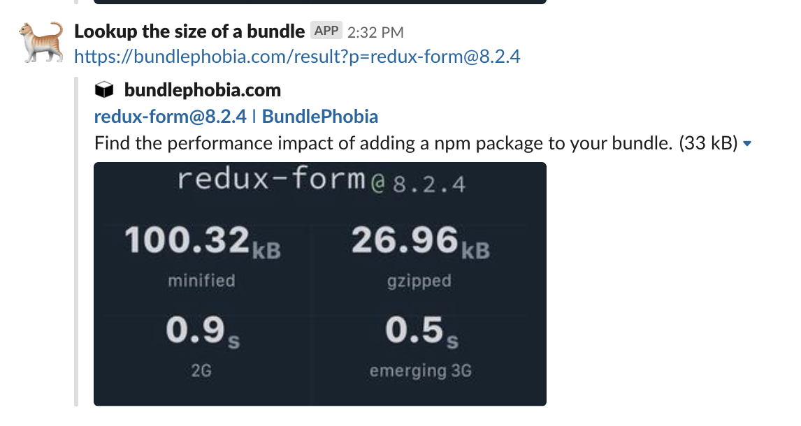

This is an azure function that prints the size of npm package in slack. For us, Slack users can type `/yikes lodash` and our webhook looks up the latest version of the package, and then generates a url which slack will unfurl as an image of the bundle size. Big thanks to [bundle phobia](https://bundlephobia.com/)

